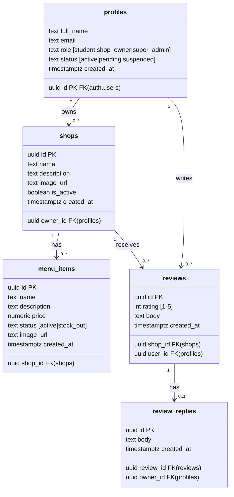
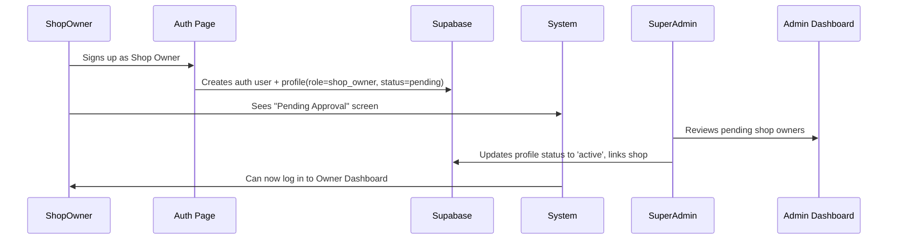

I have created the following plan after thorough exploration and analysis of the codebase. Follow the below plan verbatim. Trust the files and references. Do not re-verify what's written in the plan. Explore only when absolutely necessary. First implement all the proposed file changes and then I'll review all the changes together at the end.

## Observations

This is a **greenfield project** — the workspace is completely empty. The spec is well-defined: a Next.js (App Router) + Supabase platform with three roles (Student, Shop Owner, Super Admin), a core review/rating system, leaderboard, and responsive UI (sidebar on desktop, bottom nav on mobile). Notifications and chat are explicitly marked as **future scope** and will not be part of this plan.

---

## Approach

Bootstrap the project using `create-next-app` with the App Router, then build from the database outward: schema → RLS → auth → server actions/API → UI layers. This bottom-up approach ensures every UI component is backed by working, secure data access before wiring up the interface.

---

## Implementation Plan

### Phase 1 — Project Bootstrapping

1. **Scaffold the project** with `create-next-app` selecting: TypeScript, Tailwind CSS, App Router, and the `src/` directory. This gives you `src/app/`, `src/components/`, etc.

2. **Install core dependencies:**
   - `@supabase/supabase-js` and `@supabase/ssr` — for cookie-based auth in App Router
   - `zustand` — for lightweight client-side state
   - `next-sitemap` — for SEO sitemap generation
   - `lucide-react` — for consistent icons across the UI

3. **Configure environment variables** in `.env.local`:
   - `NEXT_PUBLIC_SUPABASE_URL`
   - `NEXT_PUBLIC_SUPABASE_ANON_KEY`
   - `SUPABASE_SERVICE_ROLE_KEY` (server-only, for super admin operations)

4. **Set up Supabase clients** in `src/lib/supabase/`:
   - `client.ts` — `createBrowserClient` for Client Components
   - `server.ts` — `createServerClient` (with cookie handling) for Server Components & Server Actions
   - `middleware.ts` — session refresh helper using `updateSession`

5. **Configure `middleware.ts`** at the project root to protect routes by role, redirecting unauthenticated users and enforcing role-based access using Supabase session + user metadata.

---

### Phase 2 — Database Schema (Supabase / PostgreSQL)

Design all tables in Supabase. Apply migrations via the Supabase dashboard SQL editor or CLI.

#### Entity Relationship



**Key design decisions:**
- `profiles.role` drives all RLS logic.
- `profiles.status = 'pending'` for shop owners awaiting super admin approval.
- `reviews` are **insert-only** (no `UPDATE` or `DELETE` RLS policies for users) — satisfies the "cannot be deleted" requirement.
- Add a **computed column or Postgres function** `get_shop_average_rating(shop_id)` that returns `AVG(rating)` and `COUNT(*)` — used by both the shop page and the leaderboard.
- Create a **leaderboard view** (`leaderboard_view`) as a Postgres VIEW: `SELECT shop_id, avg_rating, review_count FROM reviews GROUP BY shop_id HAVING COUNT(*) >= 5 ORDER BY avg_rating DESC`.

#### Row Level Security Policies

| Table | SELECT | INSERT | UPDATE | DELETE |
|---|---|---|---|---|
| `profiles` | Own row or super_admin | On signup (via trigger) | Own row | super_admin only |
| `shops` | Everyone (public) | super_admin only | Owner of shop or super_admin | super_admin only |
| `menu_items` | Everyone (public) | Shop owner (own shop) | Shop owner (own shop) | Shop owner (own shop) |
| `reviews` | Everyone | Authenticated students (one per shop enforced via UNIQUE constraint) | ❌ No | ❌ No |
| `review_replies` | Everyone | Shop owner of parent shop | ❌ No | ❌ No |

- Create a Postgres trigger on `auth.users` to auto-insert a row in `profiles` on signup, setting `role = 'student'` by default (shop owner signups set `role = 'shop_owner'` and `status = 'pending'` via a separate Server Action).

---

### Phase 3 — Authentication System

Organize auth routes under a route group `src/app/(auth)/`:

- **`/login`** — Email/password login + Google OAuth button. After login, redirect based on role: students → `/dashboard`, shop owners (approved) → `/owner/dashboard`, super admin → `/admin/dashboard`.
- **`/signup`** — Two-path form: "Sign up as Student" (immediate active) vs. "Sign up as Shop Owner" (sets status to `pending`, shows "await approval" message).
- **`/auth/callback`** — OAuth callback route handler using Supabase's `exchangeCodeForSession`.

**DIU email auto-verification:** In the signup Server Action, check if the email domain matches `@diu.edu.bd` (or the correct DIU domain). If yes, mark the student profile as verified immediately via a `is_diu_verified` boolean column on `profiles`.

**Shop Owner approval flow:**


---

### Phase 4 — Route Structure & Layouts

```
src/app/
├── (auth)/
│   ├── login/page.tsx
│   ├── signup/page.tsx
│   └── auth/callback/route.ts
├── (student)/
│   ├── layout.tsx              ← Sidebar (desktop) + Bottom Nav (mobile)
│   ├── dashboard/page.tsx      ← Shop listing cards
│   ├── shops/[shopId]/page.tsx ← Shop detail page
│   ├── leaderboard/page.tsx    ← Top-rated shops
│   └── my-reviews/page.tsx     ← Student's own reviews
├── (owner)/
│   ├── layout.tsx              ← Owner sidebar layout
│   ├── dashboard/page.tsx      ← Shop stats overview
│   ├── menu/page.tsx           ← Manage menu items
│   └── reviews/page.tsx        ← View & reply to reviews
├── (admin)/
│   ├── layout.tsx              ← Admin sidebar layout
│   ├── dashboard/page.tsx      ← System analytics
│   ├── shops/page.tsx          ← Add/manage shops
│   ├── users/page.tsx          ← User management
│   └── approvals/page.tsx      ← Pending shop owner approvals
└── layout.tsx                  ← Root layout (Supabase provider, fonts)
```

- Each route group layout enforces role via a server-side session check, redirecting unauthorized users.
- `middleware.ts` handles session refresh on every request.

---

### Phase 5 — Shared UI Component Library

Create reusable components in `src/components/`:

| Component | Description |
|---|---|
| `StarRating` | Interactive (for submitting) and display-only star rating (1–5) |
| `ShopCard` | Thumbnail, name, average rating, review count — used on dashboard & leaderboard |
| `ReviewCard` | Shows reviewer name, stars, review text, and reply (if any) |
| `ReviewForm` | Star selector + text area; submits via Server Action; locked after one submission per shop |
| `ReplyForm` | Owner-only text area under a review |
| `MenuItemCard` | Item name, price, status badge (Active / Stock Out) |
| `Sidebar` | Desktop navigation: Dashboard, Leaderboard, My Reviews, (role-based links) |
| `BottomNav` | Mobile bottom navigation with the same links |
| `StatusBadge` | Reusable `Active` / `Stock Out` / `Pending` pill badge |
| `LeaderboardTable` | Ranked table of shops with rank, name, avg rating, review count |
| `AnalyticsCard` | Admin dashboard stat cards (total reviews, users, shops, avg rating) |

---

### Phase 6 — Core Feature: Review & Rating System

All mutations use **Next.js Server Actions** (in `src/app/actions/`):

- **`submitReview(shopId, rating, body)`** — Enforces one review per user per shop using a `UNIQUE(shop_id, user_id)` constraint on the `reviews` table. Insert-only.
- **`submitReply(reviewId, body)`** — Only callable by the shop owner of the shop the review belongs to (validated server-side + RLS).
- After any review insert, recalculate and cache the shop's average rating. Use Supabase's real-time or simply re-query on page load (no need for complex caching given the scale).

**Fake review mitigation (basic algorithm):**
- Enforce one review per verified account per shop (DB constraint).
- Add a `review_count` threshold check before displaying any shop's rating prominently.
- Flag reviews from accounts created within the last 24 hours as `needs_review` for the super admin to inspect.

---

### Phase 7 — Shop Owner Dashboard

Located at `(owner)/dashboard`, this is a Server Component that:
- Fetches the owner's linked shop from `shops` where `owner_id = current_user_id`.
- Displays average rating, total reviews, and a list of reviews with reply forms.
- The **Menu Management** page (`(owner)/menu`) allows adding, editing menu items and toggling `status` between `active` and `stock_out` via Server Actions.

---

### Phase 8 — Super Admin Dashboard

Located at `(admin)/`:
- **Approvals page** — Lists all `profiles` where `role = 'shop_owner'` and `status = 'pending'`. Provides "Approve" (updates status to `active`) and "Reject" (updates status to `suspended`) actions using the service role key via Server Actions.
- **Shop management** — CRUD for shops: add a new shop and assign it to an approved owner.
- **User management** — View all users, filter by role/status.
- **Analytics** — Aggregate stats: total reviews per shop, rating distribution, top/bottom rated shops.

---

### Phase 9 — Leaderboard

`(student)/leaderboard/page.tsx` as a **Server Component**:
- Queries the `leaderboard_view` Postgres view (min 5 reviews threshold, ordered by `avg_rating DESC`).
- Renders a ranked list using `LeaderboardTable` component.
- Also embed a top-3 widget in `(student)/dashboard/page.tsx` for quick visibility.

---

### Phase 10 — Performance & SEO

- All shop listing and shop detail pages are **Server Components** with data fetched server-side — no client-side waterfall fetches.
- Use Next.js `generateMetadata` in `shops/[shopId]/page.tsx` to generate dynamic `<title>` and Open Graph tags per shop.
- Add JSON-LD structured data (e.g., `LocalBusiness` schema) on each shop page.
- Configure `next-sitemap` to generate sitemaps for `/`, `/dashboard`, `/leaderboard`, and each `/shops/[shopId]`.
- Use Supabase indexes on `reviews(shop_id)`, `reviews(user_id)`, and `menu_items(shop_id)` for query performance.
- Use `next/image` for all shop and menu item images with explicit `width`/`height` and Supabase Storage as the image source.

---

### Phase 11 — Configuration Files

| File | Purpose |
|---|---|
| `tailwind.config.ts` | Define custom design tokens: brand colors (e.g., DIU blue/green), font sizes |
| `next.config.ts` | Add Supabase Storage domain to `images.remotePatterns` |
| `next-sitemap.config.js` | Configure sitemap generation post-build |
| `.env.local` | All environment variables (never committed) |
| `src/middleware.ts` | Route protection + session refresh for all `(student)`, `(owner)`, `(admin)` paths |